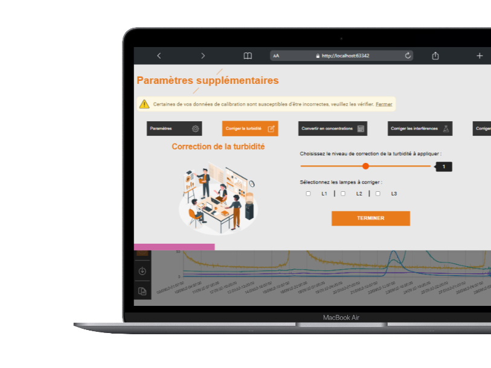

# 🌊 FluoGraphiX

<p align="center">
  
  
  
</p>

<p align="center">
  <strong>Un outil de visualisation et de traitement des données fluorimétriques, conçu pour les campagnes de traçage en hydrogéologie.</strong><br/>
  Développé au <a href="https://www.brgm.fr/">BRGM</a> — 2024
</p>

---

## 🧠 À propos

**FluoGraphiX** est une application web et de bureau permettant aux hydrogéologues de **visualiser**, **calibrer** et **traiter** des données issues de **fluorimètres**, utilisées lors de **campagnes de traçage**.

Ce projet a été initié lors d’un stage de deuxième année de BUT Informatique (avril–juin 2024), puis poursuivi en développement open source. Deux versions sont en cours :
- Une version HTML/CSS/JS légère, utilisable **hors-ligne** (via un ZIP téléchargeable - version actuelle)
- Une version **ElectronJS + VueJS** avec **mise à jour automatique**, disponible en téléchargement (via un .EXE - à venir)

---

## ✨ Fonctionnalités principales

- 📁 Import de données fluorimétriques (CSV, XML, MV)
- 📊 Visualisation graphique via **ChartJS**
- 🧮 Calibration des données (CSV et DAT)
- 🔧 Outils de correction et conversion des mesures
- 🖥️ Interface utilisateur claire et épurée (UI/UX)
- 💾 Utilisable hors ligne après téléchargement d'un fichier ZIP

<em>Pour en savoir plus : [Présentation de FluoGraphiX]((https://thomasloye.fr/projets/fluographix)</em>

---

## 📸 Aperçu visuel

> 📌 Exemples des interfaces de l'outil :





---

## 🔧 Technologies utilisées

| Catégorie                 | Technologies                                   |
|--------------------------|-------------------------------------------------|
| **Langages**             | JavaScript, HTML5, CSS3                         |
| **Framework**            | VueJS (à venir)                                 |
| **Librairies**           | ChartJS, ElectronJS (à venir)                   |
| **Développement**        | Git, GitHub, WebStorm                           |
| **Design & gestion**     | Figma (UI/UX), Notion (gestion de projet)       |

---

## 📈 Phases de développement

> 🕒 **275+ heures de développement**  
> 👤 **Seul développeur**  
> 🧑‍🔬 En collaboration avec les hydrogéologues du BRGM

| Phase              | Description                                                                 |
|--------------------|-----------------------------------------------------------------------------|
| **Phase 0**        | Essais avec ChartJS sur données lourdes                                     |
| **Phase 1**        | Implémentation de la navigation (routing basique)                           |
| **Phase 2**        | Création des pages satellites (import, export, aide)                        |
| **Phase 3**        | Affichage des mesures en graphique                                           |
| **Phase 4**        | Affichage/calcul des données de calibration                                 |
| **Phase 5**        | Ajout de traitements correctifs et conversions                              |
| **Phase 6**        | Refonte graphique complète (UI/UX sur Figma)                                |
| **Phase 7 (actuelle)** | Migration vers **VueJS + ElectronJS** pour version installable             |

---

## 🎓 Compétences mobilisées (BUT Informatique)

- ✅ Analyse des besoins et conception d’outil adapté
- ✅ Choix d’architectures logicielles pertinentes
- ✅ Mise en œuvre de frameworks avancés (Vue, Electron)
- ✅ Application des pratiques de développement collaboratif (Git)
- ✅ Communication avec les experts métiers (hydrogéologues)

---

## 📦 Installation (version VueJS)

> 💡 Vous pouvez télécharger le ZIP de l'outil depuis le site de FluoGraphiX

---

## 📁 Structure du projet

```txt
fluographix/
├── Ressources/           # Images, icônes, logos
├── src/
│   ├── Mecanique/        # Mécanique principale de l'outil en JS
│   ├── Modele/           # DataObjects et composants HTTP
│   ├── libs/             # Librairies utilisées par l'outil
│   └── vues/             # Interfaces utilisateurs (pages)
├── index.html
├── README.md
└── ...
```

---

## 🧰 Outils utilisés

- 🧑‍💻 IDE : **WebStorm**
- 📘 Gestion de projet : **Notion**
- 🔍 UI/UX design : **Figma**
- 🔁 Versionning : **Git & GitHub**

---

## 🤝 Contribuer

- ⭐ Star le projet pour suivre son évolution
- 📬 Ouvrir une *issue* pour signaler un bug ou proposer une idée

---

## 📜 Licence

Le projet sera bientôt publié sous la licence **MIT**.

---

## 👤 Auteur

Développé par **[Thomas LOYE]**  
📍 Stage réalisé au [**BRGM**](https://www.brgm.fr), d’avril à juin 2024  
✉️ Contact : [thomasloye1@gmail.com](mailto:thomasloye1@gmail.com)
🖥️ Site web [thomasloye.fr](https://thomasloye.fr)

---

<p align="center">
  ✨ Merci pour votre intérêt pour FluoGraphiX ✨ <br/>
  <em>Un outil libre, pensé pour les scientifiques du terrain.</em>
</p>
